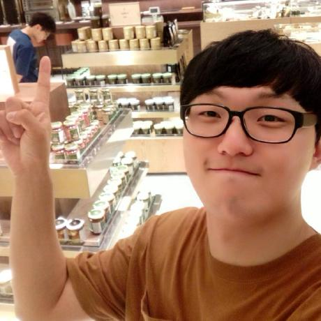

# Biography

**Address:**

(38430) 521-1, Colleage of Engineering(D2) at Daegu Catholic University, Gyeongsangbuk-do, Gyeongsan, Hayang-eup, Hayang-ro, 13-13, South Korea

**Contacts:**

email : [yooer10ms@cu.ac.kr](mailto:yooer10ms@cu.ac.kr)

mobile : (+82) 010 2647 3007

Tel : (+82) 053 850 2740

## Short Descriptions

KwangEun An(안광은) is a Student in Major of [Computer Information Communication Convergence](http://it.cu.ac.kr) at [Daegu Catholic University](http://www.cu.ac.kr)(DCU) since 2017 and a member of [Software Engineering Laboratory]() at DCU since 2015. He received his B.S. in Major of Information Communication Convergence at School of Information Technology, DCU.

He is interested in Internet of Things, Image Processing, Software Engineering, Artificial Intelligence, Machine Learning, Information Security and Linux Operating System.

## Published Papers

* KwangEun An, Jae-Young Park, Han-Na Park, Dongmahn Seo, "A Study on use case in USB OS", 2015 Fall Conference on Korea Information Processing Society, Vol. 22, No. 22, pp. 65-68, Oct 2015.

* KwangEun An, Dongmahn Seo, "A Case Study of USB OS Usage Problems", 2016 Spring Conference on Korea Information Processing Society, Vol. 23, No. 1, pp. 977-979, April 2016.

* KwangEun An, Jae Sung Park, Hong Jun Choi, Jong Sup Lee, Young Ju Jeong, Dongmahn Seo, "Smart Crosswalk System using IoT", 2016 Spring Conference on Korea Information Processing Society, Vol. 23, No. 1, pp. 931-934, April 2016.

* KwangEun An, Young Ju Jeong, SungWon Lee, Dongmahn Seo, "Smart Crossing System Using IoT", 2017 IEEE International Conference on Consumer Electronics (ICCE) - CT08: Internet of Things and Internet of Everywhere, 2017

* KwangEun An, SungWon Lee, Seungki Ryu, Dongmahn Seo, "Detecting a Pothole Using Deep Convolutional Neural Network Models for an Adaptive Shock Observing in a Vehicle Driving", 2018 IEEE International Conference on Consumer Electronics (ICCE) - ST10: Deep Learning in CE (DCE), 2018

## Personal Studies
[Machine Learning](./Study/Machine_Learning/main.md)

## Current Projects

**Image Labeling System** [GitHub](https://github.com/CUDSnSLab/Image-Labeling-Project) [Studies](./Study/Image_Labeling_System_Study/main.md)

Jan/2018 as **Developer of Deep Nerual Network & Git Repository Gardner**

**Pothole Detection System using Artificial Intelligence** [Studies](./Study/Pothole Detection System/main.md)

Dec/2017 as **Developer in Artifical Intelligence**

## Past Projects

----

### 2006

**Making of Win32 Decomplier**

Jan/2006 ~ June/2006 as **Reverse Engineer**

**Analysis of PlayStation Network**

July/2006 ~ Nov/2006 as **Network Analyser**

----

### 2007

**Wireless Hacking using Multiple Wireless Cards**

Feb/2007 ~ June/2007 as **Junior Developer**

**Latency-Zero Wireless Hijacking on Numerous Connected Wireless Environment**

July/2007 ~ Nov/2007 as **Senior Developer**

----

### 2008

**Effective Wireless Hijacking using A Single Laptop**

July/2008 ~ Nov/2008 as **Project Leader**

**Kartail(카르테일); Visual Novel Game**

July/2008 ~ Sep/2008 as **Game Programmer**

----

### 2010

**Wireless Hijacking using a Mobile**

Feb/2010 ~ June/2010 as **Project Manager**, **Lead Developer**

**Network Traffic Analysis Program**

Feb/2010 ~ June/2010 as **Project Manager**

**Web-content Source Code Vulnerability Analyzer**

Feb/2010 ~ June/2010 as **Project Manager**

**Auto Web-content Crawler for Massive Content Analyzer**

July/2010 ~ Nov/2010 as **Project Manager**, **Senior Developer**

**Research for Security Sofware Development Guide**

July/2010 ~ Nov/2010 as **Researcher**

----

### 2011

**Fine-Tuning for Bit-wise operation in C**

Feb/2011 ~ June/2011 as **Researcher**

**Acclerating the Wireless Hijacking with a Single Wireless Card**

Feb/2011 ~ June/2011 as **Project Manager**, **Senior Developer**

**Reverse Engineering of a Mobile Game**

Feb/2011 ~ June/2011 as **Project Manager**

----

### 2014

**Game Competition: 2015 Imagine Cup**

Oct/2014 ~ Dec/2014 as **Project Leader**, **Lead Game Developer**

**Innovation Competition: 2015 Imagine Cup**

Oct/2014 ~ Dec/2014 as **Project Leader**, **Lead Developer**

----

### 2015

**Global Inovation Festa 2015**

Oct/2015 as **Project Leader**, **Lead Developer**

**Ruuning a Linux Operating System on USB**

June/2015 ~ Oct/2015 as **Project Leader**, **Kernel Developer**

----

### 2016

**IoT based Pedestrian Protection System on Public Road**

April/2016 ~ Dec/2016 as **Project Leader**, **Lead Developer**

**Smart Planting**

April/2016 ~ Dec/2016 as **Web Programmer**

----

### 2017

**Pothole Detection System** 

Supported & Funded by Pothole-Free Road Pavement Management System Development in  Korea Institute of Civil Engineering and Building Technology

Jan/2017 ~ Sep/2017 as **Programmer in Artifical Intelligence & Feature-based Detection**